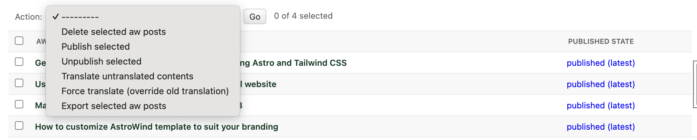

How to Use
==========

This section outlines the basic steps to use Django-headless-cms.

Define Models
-------------

Models are the core of Django-headless-cms, representing your system or content. It is crucial to invest time in practicing and designing your system's database. Before proceeding, note the following regarding relationships:

- To reference a single row, use `ForeignKey`.
- To reference multiple rows, use `ManyToManyField`, with support for `M2MSortedOrderThrough` (explained later).
- To define an abstract class that can be referenced by multiple other classes, use `GenericRelation` from `Django content types <https://docs.djangoproject.com/en/5.0/ref/contrib/contenttypes/>`_.

Normal Model
~~~~~~~~~~~~

- Create models inheriting from :ref:`LocalizedPublicationModel`.
- This base model supports auto import-export UI, versioning, publishing/drafting content, and auto-translation for any model that inherits it.
- Don't forget to register the model with `@reversion.register(exclude=("published_version",))`.

- For multi-language fields with content varying across different languages, use the following fields:

::

    # Fields from django-localized-fields
    localized_fields.fields.LocalizedCharField
    localized_fields.fields.LocalizedTextField
    localized_fields.fields.LocalizedIntegerField
    localized_fields.fields.LocalizedFloatField
    localized_fields.fields.LocalizedFileField

    # Fields implemented by django-headless-cms
    headless_cms.fields.LocalizedUniqueNormalizedSlugField
    headless_cms.fields.LocalizedBooleanField
    headless_cms.fields.AutoLanguageUrlField
    headless_cms.fields.LocalizedMartorField

Example:

::

    @reversion.register(exclude=("published_version",))
    class Action(LocalizedPublicationModel):
        text = LocalizedCharField(blank=True, null=True, required=False)
        icon = CharField(default="", blank=True)

Singleton Model
~~~~~~~~~~~~~~~

- For singleton models, such as a model representing your `Landing Page` or `Contact Page`, inherit from :ref:`LocalizedSingletonModel`.

Example:

::

    @reversion.register(exclude=("published_version",))
    class IndexPage(LocalizedSingletonModel):
        title = LocalizedTextField(default=dict, blank=True, null=True)
        description = LocalizedTextField(default=dict, blank=True, null=True)

Title Slug Model
~~~~~~~~~~~~~~~~

- For models requiring a `title` field and a `slug` field auto-generated from the title (e.g., `Post` model), inherit from :ref:`LocalizedTitleSlugModel`.

Example:

::

    @reversion.register(exclude=("published_version",))
    class Post(LocalizedTitleSlugModel):
        excerpt = LocalizedTextField(blank=True, null=True, required=False)
        image = models.ForeignKey(
            PostImage,
            blank=True,
            null=True,
            on_delete=models.SET_NULL,
            related_name="posts",
        )
        draft = models.BooleanField(default=False)
        author = LocalizedCharField(blank=True, null=True, required=False)
        content = LocalizedMartorField(default=dict, blank=True, null=True, required=False)
        publish_date = DateTimeField(blank=True, null=True)
        updated_date = DateTimeField()

Dynamic File Model
~~~~~~~~~~~~~~~~~~

- For models that allow either file uploads or external links and return the source based on either field (e.g., an image model), use :ref:`LocalizedDynamicFileModel`.

Example:

::

    class Image(LocalizedDynamicFileModel):
        author = LocalizedCharField(blank=True, null=True, required=False)

Sorted M2M Through Model
~~~~~~~~~~~~~~~~~~~~~~~~

- For a M2M through model that can be sorted via the admin interface, inherit from :ref:`M2MSortedOrderThrough`.

Example:

::

    @reversion.register(exclude=("published_version",))
    class PriceItem(LocalizedPublicationModel):
        title = LocalizedCharField(blank=True, null=True, required=False)
        subtitle = LocalizedCharField(blank=True, null=True, required=False)

    @reversion.register(exclude=("published_version",))
    class Pricing(LocalizedPublicationModel):
        prices = models.ManyToManyField(
            PriceItem,
            related_name="pricing",
            blank=True,
            through="PriceItemThrough",
        )

    class PriceItemThrough(M2MSortedOrderThrough):
        pricing = models.ForeignKey(Pricing, on_delete=models.CASCADE)
        price_item = models.ForeignKey(PriceItem, on_delete=models.CASCADE)

.. note::
    For self-referencing models, ensure you add `fk_name`, which is the field name of the parent model that the
    through model points to.

Example:

::

    @reversion.register(exclude=("published_version",))
    class Post(LocalizedTitleSlugModel):
        excerpt = LocalizedTextField(blank=True, null=True, required=False)

        related_posts = models.ManyToManyField(
            "self",
            blank=True,
            through="RelatedPost",
            symmetrical=False,
        )

    class RelatedPost(M2MSortedOrderThrough):
        fk_name = "source_post"

        source_post = models.ForeignKey(
            Post, on_delete=models.CASCADE, related_name="source_through"
        )
        related_post = models.ForeignKey(
            Post, on_delete=models.CASCADE, related_name="related_through"
        )

Define Admin
------------

Auto admin
~~~~~~~~~~

To quickly set up the admin interface for your models, you can use the :ref:`auto_admins` utility provided by `headless_cms.admin`. This utility automatically registers your models with the Django admin site.

Example:

::

    from headless_cms.admin import auto_admins
    from your_app.models import Article, Post

    auto_admins([Article, Post])

In this example, the :ref:`auto_admins` function is used to register the `Article` and `Post` models with the Django admin site. This setup allows you to manage these models through the admin interface without manually registering each one.

Manual Admin
~~~~~~~~~~~~
If you want to extend or modify the admin interface, inherit from :ref:`EnhancedLocalizedVersionAdmin`. There are
several utilities available to assist you in creating the admin interface, so be sure to check :ref:`Admin` for more information.

Define Serializers & Views
--------------------------

Auto Serializers
~~~~~~~~~~~~~~~~

Django-headless-cms provides utilities to automatically generate serializers for your models, simplifying the setup of
API views. Below is a simple example demonstrating how to use auto serializers along with custom pagination and
viewsets. For more information, refer to :ref:`auto_serializer`.

Example:

::

    from rest_framework.pagination import PageNumberPagination
    from rest_framework.viewsets import ReadOnlyModelViewSet

    from headless_cms.mixins import CMSSchemaMixin
    from headless_cms.serializers import auto_serializer

    from your_app.models import Post
    from your_app.serializers import RelatedPostSerializer

    class PostPaginator(PageNumberPagination):
        page_size = 10
        page_size_query_param = "size"

    class PostViewSet(CMSSchemaMixin, ReadOnlyModelViewSet):
        queryset = Post.published_objects.published(auto_prefetch=True)
        serializer_class = auto_serializer(Post)
        pagination_class = PostPaginator

In this example, the `auto_serializer` function is used to generate a serializer for the `Post` model. Custom
pagination is provided by the `PostPaginator` class. The `PostViewSet` class inherits from `CMSSchemaMixin` and
`ReadOnlyModelViewSet` to provide read-only access to the published `Post` objects, with the related posts being
serialized using `RelatedPostSerializer`.

.. note::
    Remember to use `.published_objects.published(auto_prefetch=True)` for the queryset in your viewsets to ensure that
    only published objects are fetched, and to enable automatic prefetching of related data.

Manual Serializers
~~~~~~~~~~~~~~~~~~

If you need to extend or customize your serializers beyond what is provided by the auto serializers, you can manually
define your serializers. Inherit from :ref:`LocalizedModelSerializer` or other appropriate base serializers and
customize as needed.

Example:

::

    from headless_cms.serializers import LocalizedModelSerializer
    from your_app.models import Post, RelatedPost

    class RelatedPostSerializer(LocalizedModelSerializer):
        class Meta:
            model = RelatedPost
            fields = ['id', 'title']

    class PostSerializer(LocalizedModelSerializer):
        related_posts = RelatedPostSerializer(read_only=True, many=True)

        class Meta:
            model = Post
            fields = ['id', 'title', 'content', 'related_posts']

In this example, `RelatedPostSerializer` and `PostSerializer` are manually defined to provide custom serialization
logic. The `PostSerializer` includes a nested `RelatedPostSerializer` to handle related posts.

Refer to :ref:`Serializers` for more information.

Admin Dashboard
---------------

Detail Page Features
~~~~~~~~~~~~~~~~~~~~

Once you register your model with the Django admin, you will have access to the following features when viewing the detail page (update form) for individual objects or content:

- **Published status**: Unpublished | Published (Outdated) | Published (Latest)
- **History**: View your object's version history, including which version is currently published.
- **Publish actions**: Publish, Unpublish, or Recursively Publish content.
- **Multi-language fields**: Use tabs to switch between languages.
- **Sortable inline items**: Drag and drop to reorder.
- **Preview related models**: View related models in modals.
- **Translation tools**: Translate missing fields, force re-translate all fields, translate children, and force re-translate children.
- **Export**: Export individual rows.

List Page Features
~~~~~~~~~~~~~~~~~~

When you visit the admin list page, you will have access to the following actions:

- Recover deleted items
- Import data
- Publish/Unpublish items
- Translate/Force re-translate items
- Export data

Admin Extra Features
~~~~~~~~~~~~~~~~~~~~

For additional admin features, such as updating the interface language via the admin panel, refer to
`django-admin-interface <https://github.com/fabiocaccamo/django-admin-interface>`_. This package provides a range
of enhancements to the Django admin interface, offering more customization and flexibility.

API Documentation & Playground
------------------------------

To enable API documentation and the playground, add the following line to your Django `urlpatterns`. This will automatically document all of your Views/Viewsets that inherit from :ref:`CMSSchemaMixin`:

::

    urlpatterns = [
        # other urls
        path("", include("headless_cms.schema.urls")),
    ]

API Documentation
~~~~~~~~~~~~~~~~~

Visit the Redoc API Documentation at http://localhost:8000/api/cms-schema/redoc/ (replace `localhost` with your
backend's deployed URL in the production environment) to view your API documentation.

API Playground
~~~~~~~~~~~~~~

.. note::
    To change the **accept-language** header when testing the API, open the URL below in incognito mode. Otherwise,
    your session language might override your header language. This issue may occur if you have integrated the language
    selection feature of the `Django admin interface`.

Visit the Swagger API Playground at http://localhost:8000/api/cms-schema/swg/ (replace `localhost` with your backend's
deployed URL in the production environment) to interact with your API. Remember to set the **accept-language** header
with the desired language code or leave it blank to use your default language.

Django Management Commands
--------------------------

Django-headless-cms provides several useful management commands to assist you:

- :ref:`Clean Outdated Drafts`: Cleans up outdated drafts.
- :ref:`Export CMS Data`: Exports your entire CMS data, supporting multiple formats.
- :ref:`Import CMS Data`: Imports your exported CMS data from a local file or remote URL.

For more information and detailed usage instructions, refer to the respective documentation for each command.

How to Use Admin Panel
----------------------

The Django-headless-cms admin panel offers several features to help you manage your content efficiently:

Publish/Draft & Versioning Content
~~~~~~~~~~~~~~~~~~~~~~~~~~~~~~~~~~

- Publish/Draft content
- Versioning content: Revert to any previously saved version
- Recursive publish

Translation
~~~~~~~~~~~

To set up the languages for your content, you need to configure the following settings in `DJANGO_SETTINGS`:

::

    LANGUAGE_CODE = "en"  # your primary content language

    LANGUAGES = [
        ("en", "English"),
        ("af", "Afrikaans"),
        ("ar", "العربية"),
        # list your languages, with the primary one at the top for convenience
    ]

- Auto-translate objects (if using OpenAI) and recursively translate.

Reset Translation
~~~~~~~~~~~~~~~~~

.. note::
    To reset translations, follow these steps:
      - Clear the content of the primary language.
      - Click on `Translation Missing`.
      - All your content will be flushed. You can now add your primary language content again.

Markdown Editor
~~~~~~~~~~~~~~~

- Use :ref:`LocalizedMartorField` to add a markdown editor field with multi-language support.

- Preview the markdown content and its utilities inside the editor.

- Preview the content in full screen to focus more on editing markdown content.

For more customization options for the markdown editor, refer to the Martor original documentation at
`django-markdown-editor (Martor) <https://github.com/agusmakmun/django-markdown-editor>`_.

Import/Export Items
~~~~~~~~~~~~~~~~~~~

- **Single Item Export**: Use the *export* button at the end of the admin page to export a single item (you may need to update the `django-import-export` package to have this feature).

- **Multiple Item Export**: Use admin actions in the list view to export multiple items at the same time (see the `Admin List Actions` section).

- **Import Items**: Use the *import* button on the admin list page to import exported content into your system. Note that imported items will be `unpublished` by default.

Admin List Actions
~~~~~~~~~~~~~~~~~~

On the admin list page, you can perform actions on multiple items:

- Publish/Unpublish items
- Translate/Force re-translate items
- Export items

