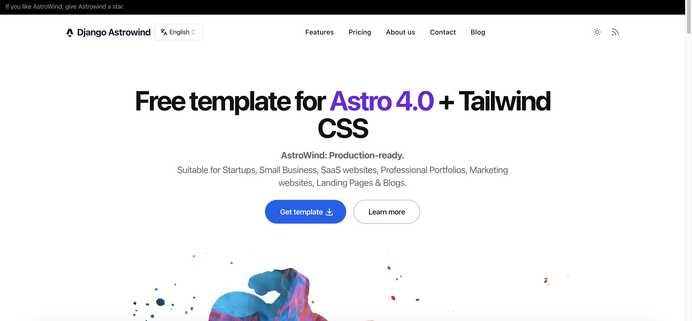

=============
Quick Start
=============

Why is this section placed first? Because a small demo is worth a thousand times more than raw documentation.
This demo uses Django-Headless-CMS to create content and publish APIs while utilizing Astrowind as the front-end
framework for display.

Demo
====

At the end of this tutorial, you will have a site that looks like this:

https://django-astrowind.netlify.app/en

What This Demo Includes
=======================

A. Backend - Django-Headless-CMS
--------------------------------
- Multi-language content support.
- Auto-generated API documentation & playground.
- Publish/Draft version management for content.
- Reversible content.
- Import/Export content.
- Sortable items.
- Markdown editor & preview.
- Custom admin interface: custom language for the admin panel, custom themes.
- API for Astrowind content.

B. Frontend - Astrowind
-----------------------
- Multi-language UI.
- Language switch button.
- Dynamic slugs for different post pages/tags.

Additional Note
===============

If you encounter any issues or errors while following this tutorial, please check the issues section or create a new one.

Prerequisites
=============

- Python >= 3.9 (you can use `PyENV <https://github.com/pyenv/pyenv>`_ to easily install and manage your Python versions).
- Cookiecutter installed. Refer to the `Cookiecutter documentation <https://cookiecutter.readthedocs.io/en/stable/README.html#installation>`_ for installation instructions.
- NVM installed (required for using Astrowind). Refer to `NVM GitHub <https://github.com/nvm-sh/nvm>`_ for installation instructions, or alternatively, install Node.js >= 18.

Getting Started
===============

a) Create a Workspace for Both Backend and Frontend
---------------------------------------------------

First, create a folder to contain both the backend (BE) and frontend (FE) projects:

.. code-block:: shell

    mkdir "/path/to/parent"
    cd "/path/to/parent"

b) Backend - Django-Headless-CMS Setup
--------------------------------------

Make sure you have installed `cookiecutter` as mentioned above, then run this command to bootstrap our backend with an opinionated template. **Note:** Select option **2** - `AstroWind` template at step 10:

.. code-block:: shell

    python -m cookiecutter https://github.com/huynguyengl99/cookiecutter-djhcms

.. image:: images/quick-start/cookiecutter.png
   :alt: DjHCMS Cookiecutter

- Open the created project.
- Follow the `README.md` inside the created project to initialize the backend, up to and including section `4. Getting Started`.
- After completing the setup, check the API.
- Visit http://localhost:8000/api/cms-schema/swg/ in incognito mode (to use the language code in the API header, otherwise it will be overridden by the Django admin language session). Input the generated API key in `Authorize`. (If you forget this step, refer to the BE `README.md`, which starts with `In order to use the below API playground, create an API key`).
- Example:

.. image:: images/quick-start/index_request.png
   :alt: Index request

You should receive a response like this:

.. image:: images/quick-start/index_response.png
   :alt: Index response

If you see the request and response as shown above, the backend setup is complete. Let's move to the next part.

c) Frontend - Django Astrowind Setup
------------------------------------

- Change the directory back to the parent workspace.
- Clone the GitHub repository (you can rename it if you want):

.. code-block:: shell

    git clone https://github.com/huynguyengl99/django-astrowind.git

- Open the cloned project.
- Copy `.env.TEMPLATE` to `.env` and add the generated API key to the environment variables.
- Install dependencies:

.. code-block:: shell

    npm install

- Sync schemas (from your backend API schema), types (inferred from your schema), and contents (fetched from your backend):

.. code-block:: shell

    npm run sync:all

.. note::
    Your *schemas*, *types*, and *content* will be placed in the following files/folders respectively:
        - src/schemas/content.ts
        - src/types/content.ts
        - src/content/auto-*

- Run the project:

.. code-block:: shell

    npm run dev

- [Optional] When you want to deploy the site, modify the `src/config.yml` file.
- If everything works well, you should see the page open, navigate between tabs, and change languages, even for posts.

Examples:
- Home page in `English`:

.. image:: images/quick-start/home-page.png
   :alt: Home page

- Pricing page in `Chinese`:

.. image:: images/quick-start/zh-pricing.png
   :alt: Pricing page

- Post list page in `Vietnamese`:

.. image:: images/quick-start/vn-post-list.png
   :alt: Post list

- Post article page in `Arabic`:

.. image:: images/quick-start/ar-post-detail.png
   :alt: Post detail

d) Making Changes
-----------------

.. note::
    Remember to sync content with the command `npm run sync:content` every time you want to update data from the backend.

- Visit http://localhost:8000/admin/astrowind_posts/awpost/1/change/ to update the first post.
- Update the `title` field under the `English` tab to: `Hello world`.
- Update the `title` field under the `Vietnamese` tab to: `Xin chao`.
- Save the post.
- Sync the API by running `npm run sync:content` in the frontend terminal. You will see that nothing updates (the
  last line you see would be `> vite-node scripts/sync.ts`).
- Now restart the frontend server.
- Visit the blog page again (http://localhost:4321/en/blog). You will notice that **NOTHING HAS CHANGED** (The title
  of the first blog is still the same). This is because the post has not been published yet, so the API call uses the
  published version, and the title remains unchanged.
- Visit http://localhost:8000/admin/astrowind_posts/awpost/1/change/ again. You will see `Item published (outdated).`.
- Click the `Publish` button to publish the post.
- Sync the API again by running `npm run sync:content` in the frontend terminal. You will now see logs like
  `Write to file /path/to/your/project/src/content/auto-posts/en/1.json` (and so on for other languages).
- Restart the frontend server again.
- Visit the blog page again. This time, you will see the updated title.

e) Create a New Post and Auto-Translate Using OpenAI ChatGPT
------------------------------------------------------------

- This option is **optional**. Make sure that you are familiar with ChatGPT (very famous now); otherwise, you can skip
  this section.
- Open your backend project and add your OpenAI key to `OPENAI_API_KEY` in the `.env` file.

.. note::
    You can create your OpenAI keys at: https://platform.openai.com/api-keys.

- Restart the BE server.
- Visit http://localhost:8000/admin/astrowind_posts/awpost/add/
- Fill out the post in `English`, for example:
   - Title: `My favorite post`
   - Author: `John Doe`
   - Content:

.. code-block:: text

    # How are you?

    This is the greeting, said in English.

- Publish date: Click on `today` and `now` to auto-populate.
- Click `Save and continue editing`.
- Click the `Translate missing` button to use AI to translate the post into other languages.
- Click `Publish` to publish the post.
- Sync the API by running `npm run sync:content` in the frontend terminal.
- Restart the FE dev server.
- Visit http://localhost:4321/en/blog to see the new post at the top of the page.
- Click the post to view its details.
- Select other languages to see the post translated into different languages.

Troubleshooting
---------------
- How to add other languages:

  - On the backend side, refer to the :ref:`Translation` documentation for more information.
  - On the frontend side, visit `src/utils/languages.ts` and uncomment (add) your desired languages. You can also
    change your default language as well.

- When I increase the number of languages, the `npm run sync:content` command raises errors, and on the backend side,
  I see some `Broken Pipe` logs.

  - This is because the Django *runserver* command cannot handle multiple concurrent requests well. You can migrate
    to use the uvicorn command. For example:

.. code-block:: shell

    uvicorn config.wsgi:application --app-dir ./your_project_slug --host 0.0.0.0 --interface wsgi

**And that's all about getting started with Django-headless-cms in conjunction with Astrowind. For more information,
explore the other sections of the documentation.**
